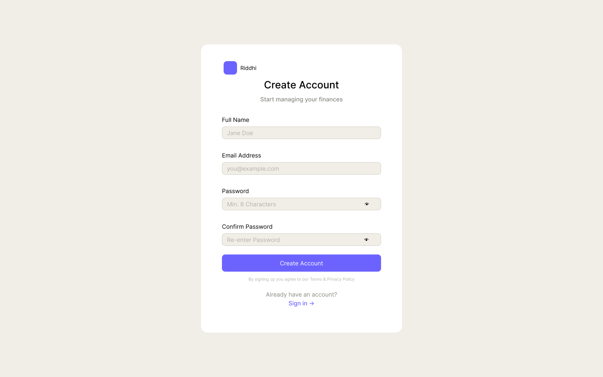
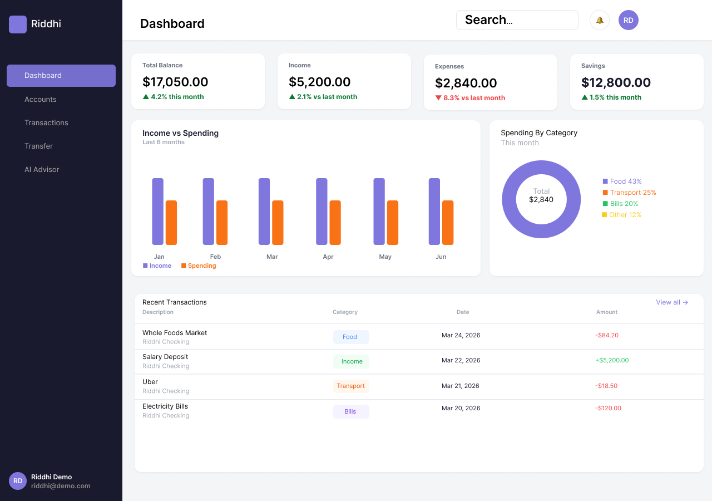

# Riddhi - Financial Dashboard

A modern, full-featured financial dashboard web application built to demonstrate
real-world frontend skills including data visualization, authentication flows,
form handling, and AI integration.

---
## 🎨 Figma Designs

**Login Page**  

**Dashboard Page**  

---
## Pages & Routes

### Unauthenticated (Public)
| Page | Route | Notes |
|------|-------|-------|
| Landing Page | `/` | Entry point |
| Auth — Login & Register | `/login` `/register` | Authentication flow |

### Authenticated
| Page | Route | Notes |
|------|-------|-------|
| Dashboard — Overview | `/dashboard` | Most impressive view, key metrics |
| Accounts | `/accounts` | Core feature — account management |
| Transactions | `/transactions` | Transaction history & filtering |
| Transfer Money | `/transfer` | Demonstrates form mastery |
| AI Advisor | `/advisor` | AI-powered financial insights |
| Analytics *(tentative)* | `/analytics` | May be added based on scope |
| Settings & Profile *(tentative)* | `/settings` | May be added based on scope |

---

## Tech Stack

### Foundation
| Tech | Purpose |
|------|---------|
| TypeScript | Type safety — required in 80%+ of jobs |
| React 19 | UI framework |
| Next.js 15 | Full-stack framework, the new standard |
| Tailwind CSS | Fastest styling in 2026 |

### State & Data Fetching
| Tech | Purpose |
|------|---------|
| TanStack Query | Replaces useEffect for API calls |
| Zustand | Global state — replaced Redux |
| React Hook Form + Zod | Form handling & validation |

### Backend & Database
| Tech | Purpose |
|------|---------|
| Next.js API Routes | Backend inside Next.js |
| Prisma ORM | Type-safe DB queries |
| PostgreSQL via Supabase | Database (free tier) |

### Auth, Testing & DevOps
| Tech | Purpose |
|------|---------|
| Clerk / NextAuth.js | Authentication |
| Vitest + Testing Library | Modern test setup |
| Vercel | Deployment |
| GitHub Actions | CI/CD pipelines |

### UI Libraries
| Tech | Purpose |
|------|---------|
| shadcn/ui | Component library — composable, hottest in 2026 |
| Radix UI | Underlying shadcn primitives |
| Recharts / Chart.js | Financial charts & graphs |

---

## Design
- Figma designs in progress
- Pages designed so far: Dashboard Overview, Login

---

## Status
🚧 In active development — design phase

---
